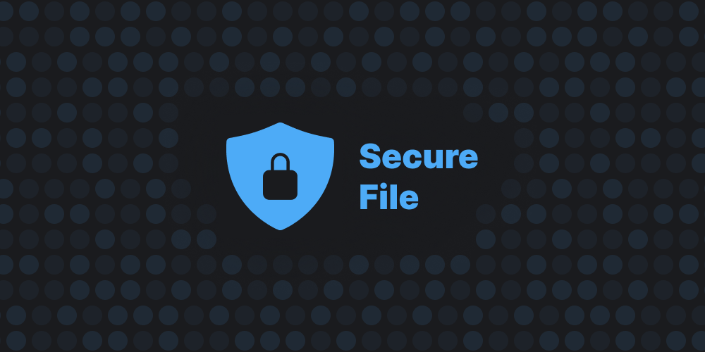

# Secure File

## Free and open source web-app, which lets you store your files inside your browser!

### About: 
Secure file as a free and open source web app, which lets you to encrypt your files and store them inside your browser, instead of inside your file system, you can also share your files with others, with a web rtc connection(coming soon)!

### Browser support:
Secure file currently is fully supported on the latest releases of Chrome ( and Chromium b )

### Guides:
- [Cloning / self hosting](/docs/self-hosting.md)
- [Usage](/markdown/guides/users-guide.md)

### Main libraries:
- [Next](https://nextjs.org)
- [Mantine](https://mantine.dev)
- [Comlink](https://www.npmjs.com/package/comlink)
- [Localforage](https://www.npmjs.com/package/localforage)